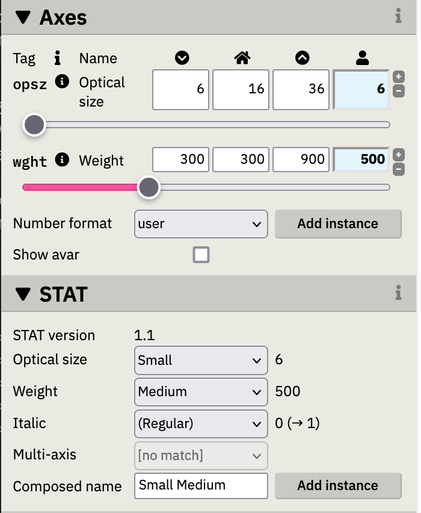

# **Maldita Producción**
### Una guía cortita y al pie para Glyphs 3.2

Esta guía es un recordatorio de cosas que revisar al terminar una tipografía. Glifos que por lo que sea dan problemas, rellenar el Font Info, una estrategia para los nombres y esas cosas que preferiríamos ignorar de las fuentes variables.

Con un poco de suerte una nueva versión de Glyphs dejará obsoleta la mitad de la guía, pero por ahora acabar fuentes es un conocimiento arcano solo apto para amantes del Terminal y toca aprender a convivir con ello.

**Preparando todo**
Cosas a instalar para ir tirando.

**¡Chequea, maldito!**
Lo que se te olvida y luego vienen los llantos.

**Rellenando el Font Info**
Abandonad toda esperanza los que aquí entréis.

**El archivo OpenType**
Porque hemos venido a este mundo a sufrir.

## Preparando todo

Hay que tener unas cuantas cosas instaladas y actualizadas para que todo vaya bien. Son unos pasos sencillos y si algo no chuta, siempre podrás invitar a comer a tu amigo el informático.

### Instalando python3

Escribe en el Terminal which python3 y pulsa Enter

Este comando comprueba si Python 3 ya está instalado. Si el Terminal responde con una ruta como `/usr/local/bin/python3`, entonces ya tienes la instalación y puedes continuar con la siguiente. Si la respuesta dice `python3 not found`, entonces necesitaremos instalarlo. 

En ese caso, obténgalo a través de una descarga desde https://www.python.org/downloads/macos/ (desplácese hacia abajo y elija el instalador universal de macOS). Ábrelo, ejecuta el instalador y sigue las instrucciones en pantalla.

### Instalando pip3

Si tienes Python instalado, probablemente ya tengas pip3. pip es el "gestor de paquetes" para Python 3. Con él, puedes instalar complementos para Python 3, normalmente bibliotecas que te dan acceso a comandos adicionales de Python. Python tiene su propio comando para instalar pip:

	python3 -m ensurepip --upgrade

Incluso si ya tienes instalado pip3, considera:

	pip3 install --upgrade pip

…para asegurarte de que tienes la última versión.

Más sobre la instalación de pip: https://pip.pypa.io/en/latest/installation/#

Instalando fonttools, brotli, zopfli, fontbakery

Ahora podemos usar pip3 para las siguientes instalaciones. Escribe:

	pip3 install fonttools --upgrade
	pip3 install brotli --upgrade
	pip3 install zopfli --upgrade
	pip3 install fontbakery --upgrade

Si las instalaciones con pip3 no funcionan, repite estas líneas con python3 -m pip al principio en vez de pip, así:

	python3 -m pip install fonttools --upgrade
	python3 -m pip install brotli --upgrade
	python3 -m pip install zopfli --upgrade
	python3 -m pip install fontbakery --upgrade

No hace está de más ejecutar este comando para una librería que ya está instalada, porque con el sufijo `--upgrade` comprueba el número de versión y actualiza a la última versión si procede.

### Preparando Glyphs

Instalar la última versión de Glyphs

En `Window/Plugin Manager` desinstalar e instalar los Modules

En `Scripts`, instalar los Mekkablue Scripts

En `Preferencias/Addons` escoger la versión de Python que pone (Glyphs)

## ¡Chequea, maldito!

### Chequeo de problemas tontos

`Paths/Correct Path Directions`: Mejor haberlo hecho antes, ahora te jodes si se fastidia todo.

Crear el glifo `nbspace (uni00A0)`, se hace solo a partir del espacio.

Crear `soft hyphen (u00AD)`.

Asegurarse de que todas las letras estén en un grupo de kerning.

Chequear los glifos con Dotbelow, que fallan a veces.

Revisar prosas de Q Ơ Ư Ǿ (o mejor, usar =|@300 o similar en el espaciado y olvidarse)

Revisar el kerning de lcaron, dcaron, and tcaron.

Revisar ligaduras, æ y œ

Pon un texto de descripción en los Stylistic Sets.

Revisar los componentes anidados. No dejar componentes dentro de otros en los archivos finales. `Scripts/Mekkablue/Components/Component Problem Finder`

**Scripts de chequeo de Trazados:**

`Mekkablue/Paths/Path Problem Finder`

`Mekkablue/Paths/Find Near vertical Misses`

`Mekkablue/Paths/Rewire Fire`

`Mekkablue/Paths/New Tab with Small Paths` (entre 600-700 square units. Activar After Overlap...)

`Mekkablue/Paths/Green Blue Manager`

Estos scripts ponen emojis en los nodos con fallo y te dejan la tipo hecha un asco. Para borrar los emojis volver a chequear o: `Mekkablue/Glyphs Names.../Garbage Collection` 

**Scripts de chequeo de interpolación:**

`Mekkablue/Interpolation/Find Shapesifting Glyphs`

`Mekkablue/Interpolation/Travel Tracker`

`Mekkablue/Interpolation/Kink Finder`

`Mekkablue/Interpolation/Dekink Master Layers`

`Mekkablue/Interpolation/New Tab with Dangerous...`

### Chequeo tras deshacer componentes

Hacer la unión de ogoneks, uhorn y ohorn bonica si procede.

### Chequeo de problemas con Fontbakery

Se hace en el Terminal. Es un programilla de Google para chequear fuentes OpenType. Se puede hacer el check de Adobe, de Google, etc.

Botón derecho sobre la carpeta que tengamos la fuente / Abrir terminal en la carpeta.

`fontbakery check-adobe (arrastramos el archivo)`

Si todo está OK saldrá una magdalena, si no toca pringar. Algunos de estos errores serán de dibujo, de los vertical metrics, de cualquier cosa, vamos.

Unas pocas opciones extra:

`fontbakery -l FAIL check-adobe archivo` para ver sólo FAILs

`fontbakery check-abode --html test.hmtl archivo` para tener los resultados en html.

`fontbakery -h` para ver tooodas las opciones.

## Rellenando el Font Info

La mayoría del Font Info es sencillo, o al menos engañosamente sencillo. Aquí no me meto en lo obvio ni en opciones que sirven para cosas muy específicas. Es más un recordatorio de lo que se me olvida siempre que una guía completa de lo que hay que poner.

### Pestaña Font:

Activar `Use typo metrics`

`fsType Embedding` Editable

`glyphOrder` desordena la ventana Font, se puede hacer y activar al final del todo.

`Family Alignment Zones`

`unicodeRanges & codePageRanges`

`Export Mac Name Table Entries` desactivado

`Panose`: No sirve pa na. Ponerlo vacío y rellenar sólo si es monoespaciada.

Si la tipo es monoespaciada: `isFixedPitch` activado.

### Pestaña Masters: Hinting

`Autohinting: Zones` Meter zonas extra para versalitas, numerales pequeños, etc.

`Autohinting: Stems` Cuantos menos valores metamos, mejor. Como si es uno vertical y otro horizontal.

### Pestaña Masters: Vertical Metrics

Recuerden: Activar `Use_Typo_Metrics` en Fonts.

Para calcular los VM, mejor hacerlo con el máster más pesado y copiar los resultados en los demás masters. 

**Porque ojo: Toda la familia debe tener los mismos valores.**

Podemos usar el Script Mekkablue Font Info / Vertical Metrics Manager para ahorrar tiempo o hacerlo a manita.

**Valores hhea**

`hheaAscender` = Un poco más de la altura de la mayúscula acentuada (con un solo diacrítico) más alta. Normalmente Á o Å, idealmente >Á.

`hheaDescender` = Un poco más del punto más bajo de la minúscula más baja. Normalmente g o ç, idealmente >g. 

`hheaLineGap` = 0

No deben sumar 1000 necesariamente. Algo cerca de 1200 es deseable.

**Valores Typo**

`typoAscender` = `hheaAscender`

`typoDescender` = `hheaDescender`

`typoLineGap` = 0

En resumen, hhea=typo.

**Valores Win**

`winAscent` = El punto más alto de la familia

(Para encontrarlo: Mekkablue / Test / Report Highest and Lower...)

`winDescent` = El punto más bajo de la familia (valor integro, aunque sea negativo, ponemos positivo).

Si tras exportar, usamos el Script Test/Webfont Test HTML con Metrics activado vemos como queda de centrada la tipo en un fondo gris. Si pensamos en nuestra tipo en un botón web, estaría bien que quedase centrado.

### Pestaña Exports:

Esto se entiende mucho mejor si antes lees sobre el archivo OpenType.

### Pestaña Exports: General

`Name Table Entry: 1; ` 
El nombre de la familia si es RIBBI: *Times New Roman*
El nombre del peso si no: *Times New Roman SemiBold*

`Name Table Entry: 2; `
Si es RIBBI: *Regular, Bold, Italic, Bold Italic*
Si no es RIBBI: *Regular o Italic*

`Full Name` o `Custom P: Name Table Entry: 4; ` 
Nombre de fuente + nombre de estilo: *Times New Roman Bold Italic*

`Font Name` o `Custom P: Name Table Entry: 6; `
Nombre Postscript: *TimesNewRoman-BoldItalic*

`WWS Family Name:` Para tipos con estilos que no se ajusten a Weight Width Slope, como Optical Sizes: *Times New Roman Display*

`WWS Subfamily Name:`: *Bold Italic*

### Pestaña Exports: Style Linking

Importante para que el cuarteto RIBBI funcione bien en programas de mierda.

El resto de instancias sólo se linka con su italic (no intentar que Medium tenga su Bold, vamos).

### Pestaña Exports: Custom Parameters

**Rename Glyphs:**

Si tenemos versiones .bold de p. ej. el $ para nuestra variable y queremos exportarlas en estáticas por defecto.

### Para Variables

**Pestaña Export:**

`Add Variable Font Setting`

`Name:` Regular o Italic

`Localized Family Names: ` Si exportamos tanto estáticas como variables, cambiamos el nombre a la variable para que se distinga en el menú: *Times New Roman Variable*

`Variations PostScript Name Prefix: ` Para poner un nombre postcript, sin espacios, a nuestro gusto: *TimesNewRomanVF-Roman*

**Pestaña Export / Custom Parameters **

Establecer `Variable Font Origin`. Tiene que ser un máster. Si queremos Style Linking que vaya de Regular y Bold, el Regular tiene que ser máster. Si no, volverá de Bold al máster de origen.

`File Name:` Para que el archivo a exportar tenga el nombre que queramos y se distinga de las estáticas: *TimesNewRomanVF-Roman*

`Name Table Entry: 1; ` 
El nombre de la familia + VF, variable...: *Times New Roman Variable*

`Name Table Entry: 2; `
*Regular o Italic*

`Full Name` o `Custom P: Name Table Entry: 4; ` 
Nombre de fuente + nombre de estilo: *Times New Roman Variable*

En las instancias estáticas: `Axis Location:` Para la tabla AVAR en fuentes variables. Convierte nuestras coordenadas de diseño en coordenadas para el usuario, con un peso 400 en Regular, 700 en Bold, etc. más sencillas de usar.

Se chequea en [https://www.axis-praxis.org/samsa/](https://www.axis-praxis.org/samsa/)

Con el script `Mekkablue / test / Variable Font test HTML` podemos probar la fuente tras exportar.

**Pestaña Other **

`Font Type: Variable`

### Cursivas en fuentes variables

Si tenemos una tipo inclinada lo normal es que vaya en el mismo archivo y todo vaya bastante bien, pero si tenemos cursivas auténticas en una variable tendremos dos archivos que no interpolan entre sí, pero querremos que funcione el style linking.

Aunque tengamos una Slant, es mejor llamar al eje Italic (vete a saber por qué).

Las instancias deben tener Style Linking. Cada peso con su par en la romana, y la Bold Italic con Regular.

**Pestaña Export:**

En `Variable Font Setting`

`Name:` Italic

`Localized Family Names: ` Igual que en la romana: *Times New Roman Variable*

`Variations PostScript Name Prefix: ` Añadimos Italic: *TimesNewRomanVFItalic*

`FileName:` *TimesNewRomanVFItalic*

**En TTX**

Podemos chequear en `MacStyleValue` y `fsSelectionValue`.

Nombres Postscript: Al crearlos Glyphs pone dos veces Italic. No es importante pero podemos borrar el Segundoo para acortarlo: `TimesNewRomanVFItalic-Regular `

## Generamos las fuentes

Parece una chorrada, pero actualizar las métricas antes en todos los másters.

## El archivo OpenType

Al exportar desde Glyphs, creamos archivos .ttf .otf .woff etc. Por mucho que nos guste Glyphs, hay cosas que no acaban de exportarse como deberían (al menos en mayo de 2023).

Aquí hay un buen cirio montado entre lo que dice la [especificación OpenType](https://learn.microsoft.com/es-es/typography/opentype/spec/) que debe ser el archivo, lo que exporta Glyphs y lo que los sistemas operativos y los programas de todo tipo leen en el archivo. Si entendemos algo el archivo podremos ver porqué fallan las cosas y si podemos arreglarlas.

En el archivo la información se guarda en tablas, una para los nombres, otra para los trazados, para el orden de los glifos, etc.

Hay programas como [OTMaster](https://www.fontmaster.nl/otmaster.html) y [FontTable Viewer](https://glyphsapp.com/tools/fonttableviewer) (gratuito) para ver las tablas de los archivos OpenType.

Para acceder de forma sencilla y modificar el archivo (incluso con programación Python) necesitaremos TTX.

### TTX

TTX es un programa que convierte un archivo .otf o .ttf a XML haciendo que sea legible. Luego también convierte el XML de vuelta al tipo de archivo que queramos.

Botón derecho sobre la carpeta que tengamos la fuente / Abrir terminal en la carpeta.

`ttx (arrastramos el archivo.otf)`

Y ya podemos abrirlo con un editor de texto (TextMate va guay, hay que indicarle que es un XML abajo a la izquierda).

`ttx archivo.ttx`

Y vuelve a ser otf.

`ttx -f archivo.ttx` sobreescribe el otf original

`ttx -t -STAT (archivo)` extrae sólo la tabla STAT.

`ttx -t -STAT -o STAT.ttx (archivo)` extrae sólo la tabla STAT y nombra el archivo ttx como queramos.

Para volver a unir (merge) la STAT al archivo: `ttx -m "archivoVAR.ttf" -o "archivoVAR.ttf" STAT.ttx`

Una vez que tenemos la tablas al aire, vamos a ver algunas:

### La Tabla Name

En la tabla Name se encuentran todas las palabras en una fuente. Las cosas que nosotros tenemos que leer tipo el Copyright, el diseñador, los nombres de los pesos, etc. Cuando rellenamos algo en Font Info, normalmente va a parar a la tabla name.

Hay 26 (del 0 al 25) nombres (nameID) que están predefinidos. nameID="0" sería el copyright, por ejemplo. [Aquí puedes verlos todos](https://learn.microsoft.com/es-es/typography/opentype/spec/name).

Luego, del 256 en adelante están libres para lo que sea. Entre el 26 y el 255 no se pone nada.

La única parte complicada de la tabla name es nombrar correctamente las familias y estilos. Por temas de compatibilidad con sistemas operativos y formatos de fuentes antiguos, nombrar las fuentes y estilos y que se vean en los menús como queremos no es tan sencillo como podría parecer. 

Si rellenamos bien el Font Info, Glyphs nos rellenará la tabla Name bien y podremos seguir sin tener que cambiar nada. Vemos a ver qué nameID tenemos y para qué sirven:

**ID 1 e ID 2**

Son ID para Windows. Para programas en los que las familias sólo tienen cuatro estilos que se escogen con style linking: Regular, Italic, Bold y Bold Italic (RIBBI).

`ID 1: Family Name: Times New Roman`
`ID 2: Subfamily Name: Regular, Italic, Bold o Bold Italic`

El resto de la familia tiene este aspecto:

`ID 1: Family Name: Times New Roman SemiBold`
`ID 2: Subfamily Name: Regular o Italic`

Para Word incluso podemos acortar (Rg, It, Bd, etc) porque el menú es estrecho.

**ID 16 e ID 17**

Son los ID de los menús fetén, los de Adobe y similares. Tenemos el nombre de la tipo y luego el submenú con todos los estilos.

`ID 16: Typographic Family Name: Times New Roman`
`ID 17: Typographic Subfamily Name: SemiBold Italic`

**ID 21 e ID 22**

Nombres WWS: Weight Width Slope. Sólo se ponen en ID 22 estos tres ejes. Normalmente no se necesita poner.

`ID 21: WWS Family Name: Times New Roman Display`
`ID 22: WWS Subfamily Name: SemiBold Condensed`

**ID 4**

Es la suma del 16 y 17

`ID 4: Full Font Name: Times New Roman SemiBold Italic`

**ID 6**

El nombre PostScript. Es el nombre completo pero sin espacios. El espacio entre familia y estilo se sustituye por un guión. Es importante porque es el que usa, por ejemplo, el PDF.

`ID 6: PostScript Name: TimesNewRoman-SemiBoldItalic`

_________

En principio deberíamos tenerlo todo en su sitio si rellenamos bien los nombres en el Font Info. Con el custom parameter `Font / Name Table Entry` podemos rellenar algunos de los parámetros a mano.

### La tabla OS/2

Tiene métricas para representar las fuentes. Aquí va lo que ponemos en Weight class, Width class, Panose, fsType, algunas vertical metrics, etc. En principio no hay mucho que pueda fallar aquí.

### La tabla STAT

La tabla STAT ahora mismo no puede leerla ningún programa, pero en teoría será la que se use en el futuro para nombrar los estilos de las fuentes. Vamos, que otra tabla extra para lo mismo.

La idea es que en un mundo de fuentes variables con tropecientos estilos los menús clásicos serán impracticables, así que describiendo cómo son nuestros ejes y donde están las instancias, las combinaciones nos darían el nombre del lugar del espacio de diseño en el que estamos.

Todo esto sería genial si no fuese porque Glyphs (versión 3.2 en mayo de 2023) no la exporta perfecta. Así que aquí SÍ que toca meter mano al XML (si usas Glpyhs 3.1 es directamente escribirla a mano de lo mal que está)

Si exportamos una tipo variable con tres ejes OPSZ, WGHT e ITAL, podemos abrirla en [Samsa](https://www.axis-praxis.org/samsa/) y ver cómo se comporta en la pestaña STAT.

Y si nos movemos por nuestro XML hasta llegar a la STAT veremos algo así:

    <STAT>
    <Version value="0x00010001"/>
    <DesignAxisRecordSize value="8"/>
    <!-- DesignAxisCount=3 -->
    <DesignAxisRecord>
      <Axis index="0">
        <AxisTag value="opsz"/>
        <AxisNameID value="256"/>  <!-- Optical size -->
        <AxisOrdering value="0"/>
      </Axis>
      <Axis index="1">
        <AxisTag value="wght"/>
        <AxisNameID value="257"/>  <!-- Weight -->
        <AxisOrdering value="1"/>
      </Axis>
      <Axis index="2">
        <AxisTag value="ital"/>
        <AxisNameID value="313"/>  <!-- Italic -->
        <AxisOrdering value="2"/>
      </Axis>
    </DesignAxisRecord>
   
Lo que nos interesa aquí:

`<!-- DesignAxisCount=3 -->` 

Osea, que hay tres ejes

      <Axis index="0">
        <AxisTag value="opsz"/>
        <AxisNameID value="256"/>  <!-- Optical size -->
        <AxisOrdering value="0"/>
      </Axis>
  
y el primero es el número 0 (los ordenadores empiezan a contar por cero), tiene el tag opsz, su nombre está en la tabla name en el ID 256 (Optical size) y tiene el orden 0 en los menús. El eje italic está siempre aunque no haga falta, vete a saber porqué.

El orden recomendado para los ejes es: opsz, wdth, wght, ital

En principio todo bien, sólo es para entenderlo. Vemos que los ejes están descritos al principio de la tabla.

Ahora vamos con las instancias:

    <!-- AxisValueCount=13 -->
    <AxisValueArray>
      <AxisValue index="0" Format="1">
        <AxisIndex value="0"/>
        <Flags value="0"/>
        <ValueNameID value="260"/>  <!-- Small -->
        <Value value="6.0"/>
      </AxisValue>
      <AxisValue index="1" Format="1">
        <AxisIndex value="0"/>
        <Flags value="2"/>  <!-- ElidableAxisValueName -->
        <ValueNameID value="2"/>  <!-- Regular -->
        <Value value="10.0"/>
      </AxisValue>
      <AxisValue index="2" Format="1">
        <AxisIndex value="0"/>
        <Flags value="0"/>
        <ValueNameID value="287"/>  <!-- Subhead -->
        <Value value="18.0"/>
      </AxisValue>
      <AxisValue index="3" Format="1">
        <AxisIndex value="0"/>
        <Flags value="0"/>
        <ValueNameID value="301"/>  <!-- Display -->
        <Value value="36.0"/>
      </AxisValue>
      <AxisValue index="4" Format="1">
        <AxisIndex value="1"/>
        <Flags value="0"/>
        <ValueNameID value="272"/>  <!-- Book -->
        <Value value="300.0"/>
      </AxisValue>
      <AxisValue index="5" Format="1">
        <AxisIndex value="1"/>
        <Flags value="2"/>  <!-- ElidableAxisValueName -->
        <ValueNameID value="2"/>  <!-- Regular -->
        <Value value="400.0"/>
      </AxisValue>
      <AxisValue index="6" Format="3">
        <AxisIndex value="1"/>
        <Flags value="2"/>  <!-- ElidableAxisValueName -->
        <ValueNameID value="2"/>  <!-- Regular -->
        <Value value="400.0"/>
        <LinkedValue value="700.0"/>
      </AxisValue>
      <AxisValue index="7" Format="1">
        <AxisIndex value="1"/>
        <Flags value="0"/>
        <ValueNameID value="275"/>  <!-- Medium -->
        <Value value="500.0"/>
      </AxisValue>
      <AxisValue index="8" Format="1">
        <AxisIndex value="1"/>
        <Flags value="0"/>
        <ValueNameID value="277"/>  <!-- SemiBold -->
        <Value value="600.0"/>
      </AxisValue>
      <AxisValue index="9" Format="1">
        <AxisIndex value="1"/>
        <Flags value="0"/>
        <ValueNameID value="279"/>  <!-- Bold -->
        <Value value="700.0"/>
      </AxisValue>
      <AxisValue index="10" Format="1">
        <AxisIndex value="1"/>
        <Flags value="0"/>
        <ValueNameID value="281"/>  <!-- Black -->
        <Value value="800.0"/>
      </AxisValue>
      <AxisValue index="11" Format="1">
        <AxisIndex value="1"/>
        <Flags value="0"/>
        <ValueNameID value="283"/>  <!-- Heavy -->
        <Value value="900.0"/>
      </AxisValue>
      <AxisValue index="12" Format="3">
        <AxisIndex value="2"/>
        <Flags value="2"/>  <!-- ElidableAxisValueName -->
        <ValueNameID value="2"/>  <!-- Regular -->
        <Value value="0.0"/>
        <LinkedValue value="1.0"/>
      </AxisValue>
    </AxisValueArray>
    <ElidedFallbackNameID value="2"/>  <!-- Regular -->
    </STAT>

Y aquí vemos que hay 13 instancias: 4 para tamaños ópticos, 7 para pesos, y dos repetidas de Regular (El Regular de abajo del todo es otra cosa).

Cada peso tiene esta estructura:

      <AxisValue index="8" Format="1">
        <AxisIndex value="1"/>
        <Flags value="0"/>
        <ValueNameID value="277"/>  <!-- SemiBold -->
        <Value value="600.0"/>
      </AxisValue>
      
Esto es la instancia 8, que tiene formato 1.
Que está en el eje 1 (el segundo, Weight, el primero es 0)
Lo del Flags 0 es que es una instancia del montón
El nameID es donde tenemos el texto "SemiBold" que aparecerá en los menús.
Y está en el punto 600 de nuestro eje.

Luego los Regulars tienen esto más raro:

      <AxisValue index="5" Format="1">
        <AxisIndex value="1"/>
        <Flags value="2"/>  <!-- ElidableAxisValueName -->
        <ValueNameID value="2"/>  <!-- Regular -->
        <Value value="400.0"/>
      </AxisValue>
      <AxisValue index="6" Format="3">
        <AxisIndex value="1"/>
        <Flags value="2"/>  <!-- ElidableAxisValueName -->
        <ValueNameID value="2"/>  <!-- Regular -->
        <Value value="400.0"/>
        <LinkedValue value="700.0"/>
      </AxisValue>
      
Están dos veces, la primera en formato 1 y las segunda en formato 3. La 1 es la normalita pero la 3 significa que ese peso de valor=400 tiene style linking, con un LinkedValue=700. Osea, que el Regular cambia a Bold si haces Cmd B en indesign o clicas la **B** del menú en un programa de textos.

En ambas el Flags value es 2 y pone ElidableAxisValueName. Eso significa que si nos movemos por el eje con los sliders en vez de Times Display Regular, pondrá Times Display a secas. Más que nada para que en una tipo con cuatro ejes no salga Times Regular Bold Regular Regular. 

Aquí hay dos problemas:

El primero que no se recomienda tener duplicado el Regular en formato 1 y 3. Así que habría que borrar el 1. Es facilito con nuestro XML y para cuando leas esto igual ya está arreglado en Glyphs.

El segundo, que hay un formato 2 mucho mejor que el 1 que Glyphs no sabe hacer solito. En este formato especificamos el valor de la instancia, pero también un rango mínimo y máximo para que todas las posiciones del eje tengan nombre.

Tendría esta pinta:

      <AxisValue index="8" Format="2">
        <AxisIndex value="1"/>
        <Flags value="0"/>
        <ValueNameID value="277"/>  <!-- SemiBold -->
        <NominalValue value="600.0"/>
        <RangeMinValue value="550.0"/>
        <RangeMaxValue value="650.0"/>
      </AxisValue>
   
Donde antes había un sólo valor, ahora tenemos tres. Uno nominal también de 600 y un rango mínimo y máximo que suelen llegar a medio camino de la siguiente instancia. El el peso más fino el rango mínimo y el nominal sería el mismo y en el más grueso el nominal y el máximo también.

En cuanto al Regular y al style linking quedarían así:

      <AxisValue index="5" Format="2">
        <AxisIndex value="0"/>
        <Flags value="2"/>  <!-- ElidableAxisValueName -->
        <ValueNameID value="2"/>  <!-- Regular -->
        <NominalValue value="400.0"/>
        <RangeMinValue value="350.0"/>
        <RangeMaxValue value="450.0"/>
      </AxisValue>
      <AxisValue index="6" Format="3">
        <AxisIndex value="0"/>
        <Flags value="2"/>  <!-- ElidableAxisValueName -->
        <ValueNameID value="2"/>  <!-- Regular -->
        <Value value="400.0"/>
        <LinkedValue value="700.0"/>
      </AxisValue>
      
El Format 3 lo dejamos como está y el Format 1 lo pasamos al 2.

Ah, y abajo del todo de nuestra tabla tenemos el style linking para la Italic, que normalmente está en otro archivo. En este caso el valor de la romana es 0.0 y el de la cursiva 1.0:

      <AxisValue index="12" Format="3">
        <AxisIndex value="2"/>
        <Flags value="2"/>  <!-- ElidableAxisValueName -->
        <ValueNameID value="2"/>  <!-- Regular -->
        <Value value="0.0"/>
        <LinkedValue value="1.0"/>
      </AxisValue>
      
Y este trozo último es el nombre para cuando todos los ejes estén en Regular, que en ese caso sí aparece un Regular:

    <ElidedFallbackNameID value="2"/>  <!-- Regular -->
    
Si ahora probamos en [Samsa](https://www.axis-praxis.org/samsa/) veremos que la fuente tiene nombre estemos donde estemos en el espacio de diseño. ¡Enhorabuena, hemos triunfado sobre la técnica!    

### La tabla AVAR

Aquí vemos el mapeo que hemos hecho con `Axis Location`. El master de origen sería 0.0.

### La tabla FVAR

Aquí vemos definidos los ejes, las instancias y los nombres que tendrán en el menú.

Encima de cada instancia tenemos su `postscriptNameID` y su `subfamilyNameID`.

En el master de origen el `postscriptNameID` sale del ID 6 y el `subfamilyNameID` de ID 17

En el resto se calcula con ID 25 + `subfamilyNameID`

En Glyphs podemos usar el Custom Parameter `Postscript Name Prefix` para poner el ID 25, que debe ser diferente a las estáticas. Si no se pone, Glyphs usará `Localized Family Name `sin espacios. 
